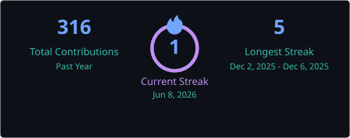

<h1 align="center">Hi 👋, I'm Masum Abedin</h1>

<h3 align="center">A passionate AI Systems Engineer from Bangladesh 🇧🇩</h3>

  

  

- 🔭 I'm currently working on **LLM-powered AI Systems & Intelligent Agents**

- 🌱 I'm currently learning **Advanced Machine Learning, RAG Architectures & AI Deployment**

- 👨‍💻 All of my projects are available at [https://github.com/Masum58](https://github.com/Masum58)

- 💬 Ask me about **AI Systems, Machine Learning, FastAPI, LLM Integration**

- 📫 How to reach me **masumab72@gmail.com**

- ⚡ Fun fact **`print("I'm not lazy, I'm in energy-saving mode.")`**

 

<h3 align="left">Connect with me:</h3>

<h3 align="left">🛠️ Languages and Tools:</h3>

  
  
  
  
  
  
  
  
  
  

<h3 align="left">📊 Statistics</h3>

